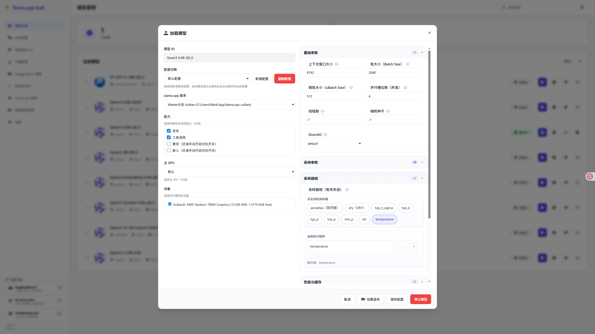

# Llama.cpp 模型管理系统

这是一个个人自用的 llama.cpp 模型管理工具，提供完整的模型加载、管理和交互功能，尽量提供不同API的兼容性。如果你觉得有什么好用的功能可以添加，请告诉我你的想法，我会尽力去增加、改善。
> **重要**：本应用需要读写文件的权限，无读写权限会导致无法进入网页、无法正常使用功能！。如Windows11的C盘，有用户发现应用放在C盘根目录会导致无法读取文件。
---
> **提醒**：模型目录的结构需要稍微注意一下，每个模型设置一个单独的文件夹，文件夹内存放GGUF文件，如分片，mmproj文件等，确保每个模型都单独放在一个文件夹内，不能将不同模型的gguf放到同一个文件夹下！模型只有加载后，才会在/v1/models中显示出来，务必注意！
---
> **重要**：下载功能 存在一些隐形的BUG，对于比较大的文件不建议使用了，还是用下载软件吧，我需要慢慢修正它。
---
> **注意**：尽管本项目作为 Java 应用具有跨平台的特性，并且llama.cpp也支持多平台，但开发目标是专门用于 **AI MAX+ 395** 这台机器，对于‘手动GPU分层’的功能暂不考虑开发（反正llama.cpp也会自动使用fit功能计算CPU和GPU的最佳配比，我觉得这个手动分层不是必须的）。
---
> **注意**：关于编译脚本，请注意JAVA_HOME的配置，默认使用系统环境变量中配置的值，如果你有多个不同版本的JDK，请确认脚本可以找到大于等于21的版本。如果系统环境变量中配置的值不是JDK21，请修改脚本，更改为正确的路径再进行编译，并且修改时请务必注意：Windows 使用 CRLF（\r\n）作为换行符，而 Linux 使用 LF（\n）。Java程序的编译是比较简单的，如果编译脚本存在问题，你也可以将它作为Maven项目拉进IDE操作。实在不行还以用release傻瓜包。
---
> **提醒**：目前支持英语版本，会根据浏览器的语言设置自动切换，也可以在url中通过lang参数手动指定英语（如：http:127.0.0.1:8080/?lang=en）。
---

## API兼容情况（llamacpp自身支持OpenAI Compatible和Anthropic API）
| 类型 | 接口路径 | 说明 |
|------|----------|------|
| 兼容 Ollama | `/api/tags`<br>`/api/show`<br>`/api/chat`<br>`/api/embed`<br>`/api/ps` | 支持 Ollama 兼容接口，可用于模型查看、聊天、嵌入向量等操作 |
| 不兼容 Ollama | `/api/copy`<br>`/api/delete`<br>`/api/pull`<br>`/api/push`<br>`/api/generate` | 不支持 Ollama 的相关操作，如模型复制、删除、拉取、推送和生成 |
| 兼容 LM Studio | `/api/v0/models`<br>`/api/v0/chat/completions`<br>`/api/v0/completions`<br>`/api/v0/embeddings` | 支持 LM Studio 的模型查询、对话、嵌入和生成功能 |


## 主要功能

### 🖥️ 模型管理

- **模型扫描与管理**：自动扫描指定目录下的所有 GGUF 格式模型，支持多个模型根目录，直观展示所有模型，支持搜索、排序（按名称、大小、参数量）（思来想去，没有做删除功能）
- **模型收藏与别名**：为常用模型设置收藏标记和自定义别名，方便快速识别
- **加载配置**：配置模型启动参数，包括上下文大小、批处理、温度、Top-P、Top-K 等
- **模型详情查看**：查看模型的详细信息，包括元数据、运行指标（metrics）、属性（props）和聊天模板（可编辑模板）
- **分卷模型支持**：自动识别和处理分卷模型文件（如 `*-00001-of-*.gguf`）
- **多模态模型支持**：支持带视觉组件的模型（mmproj 文件）
- **聊天模板**： 在模型的详细信息中，聊天模板默认不会自动加载，需要手动点击‘默认’按钮才会加载。如果点击加载后依然是空值，说明GGUF模型中可能不包含默认的聊天模板，需要在‘内置聊天模板’中选择适合的模板，或者自己手动设置一个模板。
- **对话界面**：内置聊天界面，可直接与加载的模型进行对话，用于快捷测试和验证
- **控制台日志**：实时查看系统日志，支持自动刷新
- **系统设置**：配置模型目录和 llama.cpp 可执行文件路径，设置Ollama和LM Studio兼容API，配置MCP服务，进行并发测试





### 🔌 API 兼容性

- **OpenAI API**：兼容 OpenAI API 格式（默认端口 8080），可直接接入现有应用
- **Anthropic API**：兼容 Anthropic API 格式（端口 8070）
- **Ollama API**： 兼容Ollama部分API，可以用于那些只支持Ollama的应用
- **LM Studio**：兼容LM Studio的/api/v0/** API，目前实际意义不明

### ⚡ 性能测试

- **模型基准测试**：对模型进行性能测试，评估推理速度
- **多参数配置**：支持配置重复次数、提示长度、生成长度、批量大小等测试参数
- **结果对比**：保存和对比多次测试结果，分析性能差异
- **测试结果管理**：查看、追加、删除测试结果文件


### 📊 系统监控

- **实时状态**：通过 WebSocket 实时推送模型加载/停止事件
- **控制台日志**：实时查看系统日志，支持自动刷新


### ⚙️ 配置管理

- **启动配置保存**：为每个模型保存独立的启动参数配置
- **多版本支持**：支持配置多个 llama.cpp 版本路径，加载时选择
- **多目录支持**：支持配置多个模型目录，自动合并检索
- **配置持久化**：所有配置自动保存到本地文件

### 📱 移动端适配

一定程度上照顾手机的竖屏使用体验，但是适配优先级比较低，但是能用。

### 🔧 其它功能

- **显存估算**：根据上下文大小、批处理等参数估算所需的显存占用（对于视觉模型不准确）
---

## 使用说明

### 手动编译

```bash
# Windows
javac-win.bat

# Linux
javac-linux.sh
```

> **注意**：关于Linux的编译脚本，请注意JAVA_HOME的配置，默认使用该路径：/opt/jdk-24.0.2/。请修改为你所使用的路径再进行编译，并且修改时请务必注意：Windows 使用 CRLF（\r\n）作为换行符，而 Linux 使用 LF（\n）。
---

### 直接下载
直接从release下载编译好的程序使用

### 启动程序
编译成功后，在build目录下找到启动脚本：run.sh或者run.bat，运行即可。
- 注意：默认会占用8080和8070端口，如果这两个端口不可以，请手动在**application.json**中修改监听的端口。
### 访问 Web 界面

启动成功后，在浏览器中访问：

- 主界面：`http://localhost:8080`
- 对话界面：`http://localhost:8080/chat/easy-chat.html`

### 配置模型目录和 llama.cpp 路径

1. 打开 Web 界面
2. 点击左侧菜单的「系统设置」
3. 添加模型目录（可添加多个）
4. 添加 llama.cpp 可执行文件路径（可添加多个版本）

### 加载模型

1. 在模型列表中找到要加载的模型
2. 点击「加载」按钮
3. 配置启动参数（可使用已保存的配置）
4. 点击「加载模型」开始加载

### 使用 API

加载模型后，可通过以下方式调用：

- **OpenAI API**：`http://localhost:8080/v1/chat/completions`
- **Anthropic API**：`http://localhost:8070/v1/messages`
- **Completion API**：`http://localhost:8080/completion`


### 模型目录注意

每个模型使用单独的文件夹存放，不同模型的GGUF文件不要放在相同的目录下。

### 嵌入模型 & 重排序模型

需要手动在加载页面开启对应的功能！！！


---

## 系统要求

- Java 21 运行环境
- 已编译的 llama.cpp 可执行文件